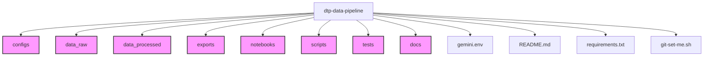

# DTP Data Pipeline Repository

Pipeline ini dirancang untuk **membersihkan, memproses, dan menyiapkan dataset** lowongan pekerjaan dalam skala besar (±12K baris) untuk digunakan pada proses **Supervised Fine-Tuning (SFT)** dan **Direct Preference Optimization (DPO)**.

---

## Fitur Utama
- **Pembersihan data** dengan handling missing values dan normalisasi data
- **Imputasi Level Pekerjaan** menggunakan data referensi PON TIK
- **Kategorisasi Level Pekerjaan** ke dalam 6 kategori standar
- **Imputasi menggunakan AI (Gemini)** untuk kolom:
  - Industri
  - Spesial Info  
  - Skillset
  - Tools
  - Deskripsi Pekerjaan
  - Status Pekerjaan
- **Ekspor hasil** dalam format Excel (.xlsx)

---

## Struktur dalam bentuk Tree
```
dtp-data-pipeline/
│
├── data_raw/             # Data mentah sebelum diproses
│   ├── PON TIK FIX - Sheet1.csv        # Data referensi okupasi dan level
│   └── Data Lowongan Pekerjaan 9001-12057 - Sheet1.xlsx  # Data lowongan utama
├── data_processed/       # Data hasil cleaning & preprocessing
│   └── cleaned_data_final.xlsx         # Hasil akhir pembersihan data
├── scripts/              # Script Python untuk pipeline
│   └── data_clean.py     # Script utama untuk pembersihan data
├── configs/              # Config YAML untuk pipeline
├── docs/                 # Dokumentasi pipeline hasil pengerjaan disini
│   ├── data_format.md
│   └── pipeline_overview.md
├── tests/                # Unit tests untuk pipeline
├── notebooks/            # Jupyter notebooks untuk eksplorasi data
├── exports/              # Hasil ekspor data dalam berbagai format
├── gemini.env            # Environment variables untuk API Gemini
├── requirements.txt      # Dependensi Python
├── git-set-me.sh         # Script untuk set identitas Git per user
└── README.md             # Dokumentasi utama repo ini
```
---

## Struktur Direktori Tree Visualize



---

## Instalasi

### 1. Clone Repo
```bash
git clone https://github.com/DTP-Fine-Tuning/dtp-data-pipeline.git
cd dtp-data-pipeline
```

### 2. Buat Virtual Environment
```bash
python3 -m venv venv
source venv/bin/activate  # Linux/Mac
# atau
venv\Scripts\activate     # Windows
```

### 3. Install Dependensi
```bash
pip install -r requirements.txt
```

### 4. Setup Environment Variables
Buat file `gemini.env` dan tambahkan API key Gemini:
```bash
GEMINI_API_KEY=your_gemini_api_key_here
```

---

## Cara Menjalankan Pipeline

### Data Cleaning dengan AI-Powered Imputation
```bash
cd scripts
python data_clean.py
```

**Proses yang dilakukan:**
1. **Load Data**: Membaca data dari `PON TIK FIX - Sheet1.csv` dan `Data Lowongan Pekerjaan 9001-12057 - Sheet1.xlsx`
2. **Normalisasi Missing Values**: Mengganti nilai seperti "Tidak Ada", "-", "" menjadi NaN
3. **Imputasi Level Pekerjaan**: 
   - Menggunakan data referensi PON TIK untuk mapping okupasi ke level
   - Kategorisasi level numeric ke kategori deskriptif
4. **AI-Powered Imputasi**: Menggunakan Gemini API untuk mengisi kolom kosong:
   - Industri
   - Spesial Info
   - Skillset  
   - Tools
   - Status Pekerjaan
   - Deskripsi Pekerjaan
5. **Export**: Menyimpan hasil ke `data_processed/cleaned_data_final.xlsx`

**Catatan**: Proses ini membutuhkan waktu cukup lama karena menggunakan API Gemini dengan rate limiting (4 detik per request).

## Dependensi Utama

- **pandas**: Manipulasi dan analisis data
- **numpy**: Operasi numerik dan handling array
- **google-generativeai**: Integrasi dengan Gemini AI untuk imputasi data
- **python-dotenv**: Manajemen environment variables
- **openpyxl**: Baca/tulis file Excel

## Struktur Data

### Input Files:
- `PON TIK FIX - Sheet1.csv`: Data referensi okupasi dan level pekerjaan
- `Data Lowongan Pekerjaan 9001-12057 - Sheet1.xlsx`: Data utama lowongan pekerjaan

### Output Files:
- `cleaned_data_final.xlsx`: Data yang telah dibersihkan dan dilengkapi

### Kategori Level Pekerjaan:
- **Internship/Magang/OJT** (Level ≤ 2)
- **Lulusan Baru/Junior/Entry Level/Fresh Graduate** (Level 3-4)
- **Associate** (Level 5)
- **Mid Senior Level** (Level 6)
- **Supervisor/Asisten Manager** (Level 7)
- **Direktur/Eksekutif** (Level ≥ 8)

---

## How to Contribute?
1. Set identitas Git per repo (Wajib dilakukan):
   ```bash
   ./git-set-me.sh "Nama Lengkap" email@example.com
   ```
2. Buat branch baru untuk fitur/pekerjaan:
   ```bash
   git checkout -b feature/nama-fitur
   ```
3. Commit & push seperti biasa

---

## Troubleshooting

### Error API Key
Pastikan file `gemini.env` sudah dibuat dan berisi API key yang valid:
```bash
GEMINI_API_KEY=your_actual_api_key_here
```

### Rate Limiting
Script menggunakan `time.sleep(4)` untuk menghindari rate limiting dari Gemini API. Jika masih error, pertimbangkan untuk menambah delay.

### Memory Usage
Untuk dataset besar, pastikan sistem memiliki RAM yang cukup (minimal 8GB recommended).

---

