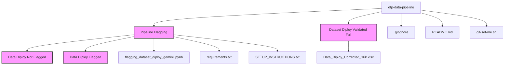
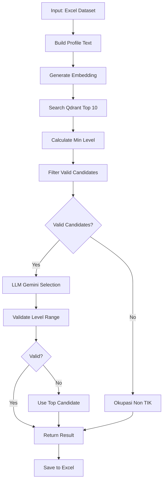

# DTP Data Pipeline Repository

Pipeline ini dirancang untuk **klasifikasi dan flagging dataset okupasi TIK** berdasarkan **Peta Okupasi Nasional TIK (PON TIK 2025)**. Pipeline menggunakan kombinasi **Vector Search (Qdrant)** dan **LLM (Google Gemini)** untuk menganalisis profil peserta dan menetapkan Area Fungsi serta Level Okupasi yang sesuai.

---

## Fitur Utama
- **Automated Flagging**: Klasifikasi otomatis Area Fungsi dan Level Okupasi menggunakan AI
- **Vector Search**: Pencarian kandidat okupasi menggunakan Qdrant vector database
- **LLM Validation**: Validasi dan pemilihan okupasi terbaik menggunakan Google Gemini
- **Smart Level Calculation**: Perhitungan level minimum berdasarkan pendidikan dan pengalaman kerja
- **Async Processing**: Processing concurrent dengan semaphore untuk efisiensi
- **Batch Processing**: Kemampuan processing per batch (500-1000 baris) untuk stabilitas

---

## Struktur Direktori
```
dtp-data-pipeline/
│
├── Pipeline Flagging/              # Pipeline utama untuk flagging dataset
│   ├── Data Diploy Not Flagged/   # Input: Dataset yang belum di-flag
│   ├── Data Diploy Flagged/       # Output: Dataset hasil flagging
│   ├── flagging_dataset_diploy_gemini.ipynb  # Notebook utama pipeline
│   ├── requirements.txt            # Dependencies Python untuk pipeline
│   └── SETUP_INSTRUCTIONS.txt      # Panduan setup lengkap
│
├── Dataset Diploy Validated Full/  # Dataset master yang sudah divalidasi
│   └── Data_Diploy_Corrected_16k.xlsx
│
├── git-set-me.sh                   # Script untuk set identitas Git per user
├── .gitignore                      # Git ignore rules
└── README.md                       # Dokumentasi utama repo ini
```

---

## Struktur Direktori Tree Visualize



---

## Area Fungsi TIK (PON TIK 2025)

Pipeline ini mengklasifikasikan profil peserta ke dalam 6 Area Fungsi TIK resmi:

| Area Fungsi | Rentang Level |
|-------------|---------------|
| **Tata Kelola Teknologi Informasi** | 3-9 |
| **Pengembangan Produk Digital** | 2-9 |
| **Sains Data-Kecerdasan Artifisial** | 2-9 |
| **Keamanan Informasi Dan Siber** | 3-9 |
| **Teknologi Dan Infrastruktur** | 2-9 |
| **Layanan Teknologi Informasi** | 1-8 |

**Catatan**: Jika profil tidak relevan dengan TIK, akan diberi label `"Okupasi Non TIK"`

---

## Teknologi yang Digunakan

- **Python 3.12.11**: Environment utama
- **Conda**: Package & environment management
- **Pandas & NumPy**: Data manipulation
- **Qdrant**: Vector database untuk semantic search
- **Google Gemini AI**: LLM untuk klasifikasi cerdas
- **Sentence Transformers**: Embedding model (gte-multilingual-base)
- **Jupyter Notebook**: Interactive development
- **Async/Await**: Concurrent processing untuk efisiensi

---

## Prerequisites

1. **Conda/Miniconda/Anaconda** (akan otomatis install Python 3.12.11)
2. **API Keys**:
   - Google Gemini API Key
   - Qdrant Cloud API Key & URL
3. **Dataset Input**: File Excel (.xlsx) dengan kolom profil peserta

---

## Instalasi

### 1. Clone Repository
```bash
git clone https://github.com/DTP-Fine-Tuning/dtp-data-pipeline.git
cd dtp-data-pipeline
```

### 2. Setup Conda Environment
```bash
# Buat environment dengan Python 3.12.11
conda create -n diploy_flagging python=3.12.11 pandas openpyxl numpy -y

# Aktivasi environment
conda activate diploy_flagging

# Install dependencies tambahan
cd "Pipeline Flagging"
pip install -r requirements.txt
```

### 3. Konfigurasi API Keys

Edit file `Pipeline Flagging/flagging_dataset_diploy_gemini.ipynb`:

```python
# GEMINI API KEY
API_KEY = "YOUR_GEMINI_API_KEY_HERE"

# QDRANT CONFIG
QDRANT_URL = "YOUR_QDRANT_URL_HERE"
QDRANT_API_KEY = "YOUR_QDRANT_API_KEY_HERE"
```

---

## Cara Menjalankan Pipeline

### 1. Persiapan Data

Pastikan file input ada di folder `Pipeline Flagging/Data Diploy Not Flagged/`:
```
diploy_unflagged_1-500.xlsx
diploy_unflagged_501-1000.xlsx
...
```

### 2. Konfigurasi File Input/Output

Edit cell konfigurasi di notebook:

```python
INPUT_FILE  = f"{DRIVE_DATASET_DIR}/Data Diploy Not Flagged/diploy_unflagged_1-500.xlsx"
OUTPUT_FILE = f"{DRIVE_DATASET_DIR}/Data Diploy Flagged/diploy_flagged_gemini_1-500.xlsx"
```

### 3. Jalankan Notebook

```bash
# Buka notebook dengan VS Code atau Jupyter
jupyter notebook "Pipeline Flagging/flagging_dataset_diploy_gemini.ipynb"
```

**Pilih kernel**: `Python 3.12.11 ('diploy_flagging')`

**Jalankan semua cell** atau jalankan cell utama (cell terakhir)

### 4. Monitoring Progress

Pipeline akan menampilkan:
- Progress bar dengan estimasi waktu
- Log real-time untuk setiap row
- Error handling & retry otomatis
- Output otomatis tersimpan ke folder `Data Diploy Flagged/`

---

## Workflow Pipeline



---

## Format Data Input

File Excel harus memiliki kolom berikut:

| Kolom | Deskripsi |
|-------|-----------|
| `Jenjang_Pendidikan` | SD, SMP, SMA, D1-D4, S1-S3 |
| `Jurusan` | Jurusan pendidikan |
| `Judul_Tugas_Akhir` | Judul skripsi/tesis (opsional) |
| `Bidang_Pelatihan` | Bidang pelatihan yang diikuti |
| `Nama_Pelatihan` | Nama pelatihan spesifik |
| `Sertifikasi` | Sertifikasi yang dimiliki |
| `Bidang_Sertifikasi` | Bidang sertifikasi |
| `Posisi_Pekerjaan` | Posisi/jabatan saat ini |
| `Deskripsi_tugas_dan_tanggung_jawab` | Detail tugas pekerjaan |
| `Lama_Bekerja` | Durasi pengalaman kerja |
| `Keterampilan` | Skill/kompetensi yang dimiliki |

---

## Format Data Output

Output akan menambahkan 2 kolom baru:

| Kolom | Deskripsi | Contoh |
|-------|-----------|--------|
| `Area_Fungsi` | Area Fungsi TIK yang sesuai | "Sains Data-Kecerdasan Artifisial" |
| `Level_Okupasi` | Level okupasi (1-9) | "6" |

**Catatan**: Jika tidak relevan TIK, `Area_Fungsi` = `"Okupasi Non TIK"` dan `Level_Okupasi` = `""`

---

## Konfigurasi Advanced

### Concurrency

Sesuaikan jumlah request parallel:

```python
CONCURRENCY = 3  # Default: 3 (aman untuk API limit)
# Bisa dinaikkan ke 5-10 jika koneksi stabil
# Bisa diturunkan ke 1-2 jika sering timeout
```

### Request Timeout

```python
REQUEST_TIMEOUT = 300  # Default: 300 detik (5 menit)
```

### Top-K Candidates

```python
# Di fungsi search_qdrant
search_qdrant(qdrant, vec, top_k=10)  # Ambil 10 kandidat terbaik
```

---

## Estimasi Waktu & Kapasitas

| Jumlah Baris | Concurrency | Estimasi Waktu |
|--------------|-------------|----------------|
| 500 | 3 | 25-40 menit |
| 1000 | 3 | 50-80 menit |
| 5000 | 3 | 4-7 jam |
| 13,594 (full) | 3 | 12-18 jam |

**Tips**: 
- Processing per batch 500-1000 baris untuk stabilitas
- Monitor API quota Gemini
- Gunakan concurrency lebih tinggi di jam off-peak

---

## Troubleshooting

### Problem: Timeout Error
**Solution**:
```python
# Turunkan concurrency
CONCURRENCY = 2

# Atau naikkan timeout
REQUEST_TIMEOUT = 600
```

### Problem: Invalid JSON Response
**Solution**: 
- Otomatis di-handle dengan fallback ke top candidate
- Check log untuk detail error

### Problem: File Output Kosong
**Solution**:
```python
# Verifikasi path input
print(os.path.exists(INPUT_FILE))

# Check dataframe
df = pd.read_excel(INPUT_FILE)
print(df.head())
```

### Problem: API Quota Exceeded
**Solution**:
- Tunggu reset quota (biasanya per hari)
- Gunakan API key alternatif
- Turunkan concurrency

---

## Best Practices

1. ✅ **Backup data** sebelum processing
2. ✅ **Test dulu** dengan sample kecil (10-20 baris)
3. ✅ **Monitor log** untuk error pattern
4. ✅ **Process per batch** untuk stabilitas
5. ✅ **Verifikasi output** setelah selesai
6. ✅ **Simpan log error** untuk troubleshooting
7. ✅ **Jangan interrupt** proses di tengah jalan

---

## Dokumentasi Tambahan

Untuk setup detail, lihat: [`Pipeline Flagging/SETUP_INSTRUCTIONS.txt`](Pipeline%20Flagging/SETUP_INSTRUCTIONS.txt)

---

## How to Contribute

1. **Set identitas Git per repo** (Wajib dilakukan):
   ```bash
   ./git-set-me.sh "Nama Lengkap" email@example.com
   ```

2. **Buat branch baru** untuk fitur/pekerjaan:
   ```bash
   git checkout -b feature/nama-fitur
   ```

3. **Commit & push** seperti biasa:
   ```bash
   git add .
   git commit -m "feat: deskripsi perubahan"
   git push origin feature/nama-fitur
   ```

4. **Buat Pull Request** untuk review

---

## License

Project ini dikembangkan untuk keperluan internal DTP Fine-Tuning team.

---

## Contact & Support

Jika ada masalah:
1. Check [`SETUP_INSTRUCTIONS.txt`](Pipeline%20Flagging/SETUP_INSTRUCTIONS.txt)
2. Lihat dokumentasi [Google Gemini API](https://ai.google.dev/docs)
3. Check status [Qdrant Cloud](https://cloud.qdrant.io)
4. Buka issue di repository ini

---

## Contributors

Tim DTP Fine-Tuning - Peta Okupasi Nasional TIK 2025

---

**Last Updated**: December 2025

