# Pipeline Overview

Dokumen ini menjelaskan **alur utama data pipeline** pada repo `llm-data-pipeline`, termasuk tahapan, input/output, serta dependensi antar proses.

---

## Tahapan Pipeline

### 1. **Data Cleaning**

* Input: `data_raw/*.json`
* Proses: hapus duplikasi, normalisasi teks, filter baris kosong.
* Output: `data_processed/cleaned.json`

### 2. **Preprocessing**

* Input: `data_processed/cleaned.json`
* Proses: format ke schema standar (`instruction`, `input`, `output`).
* Output: `data_processed/preprocessed.json`

### 3. **Splitting**

* Input: `data_processed/preprocessed.json`
* Proses: bagi dataset menjadi train/val/test sesuai proporsi.
* Output: `data_processed/train.json`, `val.json`, `test.json`

### 4. **Export**

* Input: hasil splitting/preprocessing.
* Proses: konversi ke format lain (CSV, Parquet, HuggingFace Dataset).
* Output: `exports/`

---

## Diagram Alur Pipeline (Mermaid)

```mermaid
graph TD
    A[📂 Data Raw] --> B[🧹 Cleaning]
    B --> C[⚙️ Preprocessing]
    C --> D[🔀 Splitting]
    D --> E[📤 Export]

    B:::process
    C:::process
    D:::process
    E:::process

    classDef process fill:#f9f,stroke:#333,stroke-width:2px;
```

---

## Tools yang Digunakan

* **Python** (pandas, pyarrow, datasets)
* **YAML config** untuk mengatur parameter pipeline
* **pytest** untuk unit testing

---

## Catatan

* Setiap step dapat dijalankan secara independen.
* Pipeline bisa diatur via command-line arguments atau config YAML.
* Output tiap tahap disimpan agar dapat direproses tanpa mengulang step awal.
